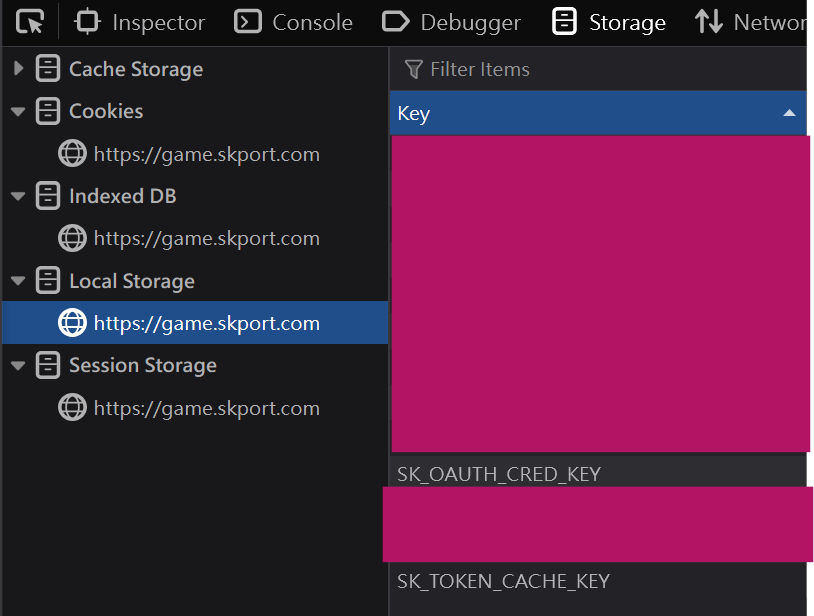
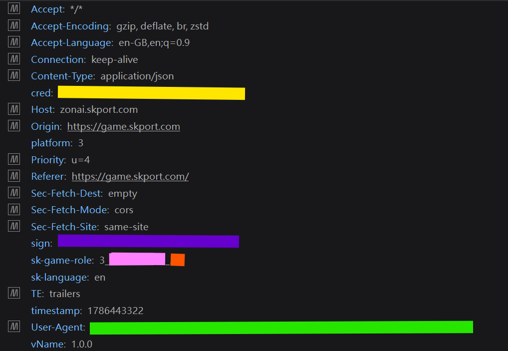

# endfield-skport-action

Automated daily check-in for **Arknights: Endfield** via [skport.com](https://game.skport.com).

## Features

- ✅ **One-click daily sign-in** — runs the same attendance call the website makes
- 🔁 **Duplicate-safe** — checks the server calendar before signing; never double-signs
- � **Self-healing tokens** — refreshes `SK_TOKEN_CACHE_KEY` automatically via `SK_OAUTH_CRED_KEY`; the token itself is optional
- �🐍 **Zero dependencies** — pure Python 3.10+ standard library, no `pip install`
- 🔔 **Discord notifications** — per-profile results (with optional `@mention`)
- 🏃 **CI-ready** — ships with a GitHub Actions workflow that runs 4×/day
- 🛡️ **Security-aware** — credentials are git-ignored and redacted from logs

## Quick start

Two ways to run it — pick one:

|          | Local (cron / manual)                              | GitHub Actions                                      |
| -------- | -------------------------------------------------- | --------------------------------------------------- |
| Config   | `config.json`                                      | Repository secrets                                  |
| Setup    | [docs/setup.md](docs/setup.md#local-configuration) | [docs/setup.md](docs/setup.md#github-actions-setup) |
| Schedule | your own cron                                      | [docs/github-actions.md](docs/github-actions.md)    |

```bash
# local run with config.json
python main.py --config-source json

# local run with environment variables (env overrides json with --config-source both)
python main.py --config-source both
```

## Getting your keys (DevTools)

The script needs the per-account `SK_OAUTH_CRED_KEY` credential that skport stores in your browser for `https://game.skport.com`. `SK_TOKEN_CACHE_KEY` is **optional** — a session token the script refreshes automatically when missing or expired:

| Key                  | What it is                                      |
| -------------------- | ----------------------------------------------- |
| `SK_OAUTH_CRED_KEY`  | OAuth credential used to authenticate API calls |
| `SK_TOKEN_CACHE_KEY` | Session token used to sign API requests         |

### How to find them

1. Log in at <https://game.skport.com>
2. Open DevTools (**F12**)
3. Go to **Storage** (Firefox) or **Application** (Chrome) → **Local Storage** → `https://game.skport.com`



You should see rows named `SK_OAUTH_CRED_KEY` and `SK_TOKEN_CACHE_KEY`. Copy `SK_OAUTH_CRED_KEY` — it never expires on the website side while you stay logged in. `SK_TOKEN_CACHE_KEY` is optional: leave it out and the script refreshes it on every run.

> 💡 **Using this with the GitHub Action?** Your game ID and server can be read from the `sk-game-role` request header in DevTools → **Network** (it has the format `3_{gameId}_{server}`), shown below:



Full walkthroughs: [docs/setup.md](docs/setup.md)

## Configuration reference

### Profiles (one per game account)

| Field                | Required | Default       | Description                                                                                       |
| -------------------- | -------- | ------------- | ------------------------------------------------------------------------------------------------- |
| `SK_OAUTH_CRED_KEY`  | ✅        | —             | From Local Storage (see above)                                                                    |
| `SK_TOKEN_CACHE_KEY` | —        | *(refreshed)* | Session token; optional — refreshed automatically via `SK_OAUTH_CRED_KEY` when missing or expired |
| `gameId`             | ✅        | —             | Game role ID (from the `sk-game-role` header)                                                     |
| `server`             | —        | `2`           | Server ID (second segment of `sk-game-role`)                                                      |
| `language`           | —        | `en`          | `sk-language` header value                                                                        |
| `accountName`        | —        | `Account N`   | Display name used in messages                                                                     |
| `myDiscordID`        | —        | global value  | Discord user ID to `@mention` in notifications                                                    |

> 💡 `SK_TOKEN_CACHE_KEY` is optional. The script treats it as a cache: when it's missing or the server rejects it (HTTP 401 / code `10000`), it is **refreshed automatically** via `SK_OAUTH_CRED_KEY` (the durable credential). When `config.json` is present, the fresh token is written back to it. If a refresh ever fails, the oauth credential has expired or changed — re-copy it from DevTools.

### Global settings

| Key                            | Default | Description                                                                            |
| ------------------------------ | ------- | -------------------------------------------------------------------------------------- |
| `discordNotify`                | `true`  | Send results to Discord. Automatically disabled when no webhook is configured          |
| `discordNotifyAlreadySignedIn` | `true`  | Also send "already checked in" notices; `false` only notifies on check-in and failures |
| `discordWebhook`               | —       | Discord webhook URL (keep empty to disable)                                            |
| `myDiscordID`                  | —       | Default Discord user ID for all profiles                                               |
| `lastSigninDate`               | —       | **Actions only** — set via `LAST_SIGNIN_DATE`; ignored in JSON configs                 |

Use `REPLACE_ME` as a placeholder for anything you haven't set yet — it is treated as "not configured".

## Security

- `config.json` is **git-ignored** — keep your keys out of version control
- `SK_OAUTH_CRED_KEY` / `SK_TOKEN_CACHE_KEY` values are redacted (`[REDACTED]`) from error messages before they reach logs or Discord
- Treat these values like passwords: anyone with them can act as your account

## Documentation

| Doc                                                | Contents                                           |
| -------------------------------------------------- | -------------------------------------------------- |
| [docs/setup.md](docs/setup.md)                     | Finding keys, local config, GitHub Actions secrets |
| [docs/github-actions.md](docs/github-actions.md)   | Workflow behavior: schedule, retries, variables    |
| [docs/how-it-works.md](docs/how-it-works.md)       | API flow, signature algorithm, exit codes          |
| [docs/troubleshooting.md](docs/troubleshooting.md) | Common errors and fixes                            |

## License

MIT — see [LICENSE](LICENSE). 

## Acknowledgments
- Adapted from: [canaria3406/skport-auto-sign](https://github.com/canaria3406/skport-auto-sign).